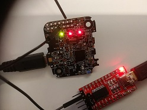

# RoKiX Sensor Node example firmware for nRF5 SDK

This repository contains an example source code for firmware and client application that can be used with [RoKiX Sensor Nodes][rokix-sensor-node].

[rokix-sensor-node]: https://www.kionix.com/news-detail/roki-sensor-node


## Description

This example includes:

1. example client application which can

    - connect to a RoKiX Sensor Node via USB and Bluetooth LE
    - receive data from a RoKiX Sensor Node

2. example firmware for RoKiX Sensor Node which can 

    - read sensor data using I2C digital bus
    - read and write GPIO lines
    - read ADC line
    - send data through USB or Bluetooth LE


### Client application

The Python client is a simple Python 2/3 application that allows you to read
data sent by the firmware. The client code is in the `client` directory.

Set-up:

1. Open a shell (e.g. `cmd.exe`) and change directory to `client`
2. Run `python -m pip install -r requirements.txt`

    2.1. If using a Bluetooth LE connection, run
         `python -m pip install -r requirements-Linux-BLE.txt`

3. By default, the example application connects to the RoKiX sensor node via USB
   and reads three 16-bit signed values in a loop. The following options are
   supported:

    3.1 The connection can be changed to Bluetooth LE. **Note** that the `mac`
        variable must be updated to match with the MAC address of the used RoKiX
        Sensor Node used in `connect()`.

    3.2 Print sensor data in SI units instead of raw data.

Usage: run `python receive_data.py`


### Firmware

The RoKiX example firmware is based on the [nRF5 SDK
15.2.0][nrf-sdk] and all needed SDK source files are include in the
project. When adding a new SDK module for the project, the nRF5 SDK must be
downloaded and the required files must be included in the firmware project.

The example firmware provides sensor drivers, GPIO, ADC and connection examples,
such as USB virtual port and BLE UART. The sensor drivers are configured to use
data ready interrupts. When an interrupt occurs, an event is put in to the
[application scheduler][nrf-app-sched]. The event is handled by an event handler
attached to the scheduler, which is executed in application context. The defined
scheduler events can be found in the `platform_functions.h` file. These events
are free to modify.

Following connections are supported for sending sensor data, e.g. to a PC:
    
- USB virtual port (CDC-ACM)
- BLE UART service

[nrf-sdk]: https://www.nordicsemi.com/Software-and-Tools/Software/nRF5-SDK/Download
[nrf-app-sched]: https://devzone.nordicsemi.com/tutorials/b/software-development-kit/posts/scheduler-tutorial


#### Sensor-data usage

The following sensor drivers are implemented:

- KX122 - Tri-axis accelerometer with orientation, tap/double tap, activity
  detecting, and Free fall algorithms.
- KMX62 - Tri-axial magnetometer plus a tri-axial accelerometer.
- KXG08 - The KXG08 is an advanced 6-axis accelerometer/gyroscope.
- BM1383AGLV - BM1383AGLV is piezo-resistive pressure sensor.
- BM1422GMV - Tri-axis magnetometer.

Data is read from every sensor. By default, the KX122 sensor data is passed to
the USB or BLE, depending on the connection. This can be changed to **main.c**
file by adding/removing the sensor ID checks in the `application_event_handler
function`.

```c
if(event->type == EVENT_READ_TWI) {
    ret = event->app_events.sensor_evt.sensor_read(data, &size);
    if (ret == NRF_SUCCESS) {
        /* Add sensor ID check here for passing certain sensor data to USB or BLE*/
        if(event->app_events.sensor_evt.sensor_id == KX122_ID) {
            ble_uart_tx(data, size);
            usb_serial_tx(data, size);
        }
    }
}
```


#### Application scheduler

Existing application scheduler events can be modified and new events can be
added to change the functionality of the firmware.

The application event structure is defined in the firmware as

```c
/* Add own event to stucture here. */
typedef struct
{
    app_event_type_t type;
    union {
        app_sensor_evt_t sensor_evt;
        app_adc_evt_t adc_evt;
    } app_events;
} app_internal_evt_t;
```

New events (e.g. KX122 I2C read) are added to application scheduler queue in the
following way

```c
static app_internal_evt_t app_event =
{
    .type = EVENT_READ_TWI,
};

app_event.app_events.sensor_evt.sensor_read = KX122_get_raw_xyz;
app_event.app_events.sensor_evt.sensor_id = KX122_ID;

/* Send event to main thread, application_event_handler */
ret = app_sched_event_put(&app_event,
                          sizeof(app_internal_evt_t),
                          application_event_handler);
```

Events are processed in the main.c event handler as shown below.

```c
/** @brief Handling application events from the scheduler. */
void application_event_handler(void * p_event_data, uint16_t event_size)
{
    /* ... */
}
```


#### Timers

Examples using [application timers][nrf-apptimer] can be found in the
`ble_uart.c`, `usb_serial.c` and `battery_measurement.c` files.

Define timer and callback function

```c
APP_TIMER_DEF(m_blink_cdc);

static void usb_cdc_blink_handler(void * p_context)
{
    bsp_board_led_invert((uint32_t) p_context);
}
```

Create timer

```c
app_timer_create(&m_blink_cdc, APP_TIMER_MODE_REPEATED, usb_cdc_blink_handler);
```

Start timer

```c
app_timer_start(m_blink_cdc,
    APP_TIMER_TICKS(LED_BLINK_INTERVAL),
    (void *) LED_CDC_ACM_CONN);
```

Stop timer

```c
app_timer_stop(m_blink_cdc);
```

[nrf-apptimer]: https://devzone.nordicsemi.com/tutorials/b/software-development-kit/posts/application-timer-tutorial


## Setup

### Requirements

- RoKiX Sensor Node
- USB-certified Micro-USB cable
- PC (tested with Windows OS)
  - [Segger Embedded Studio](https://www.segger.com/products/development-tools/embedded-studio/)
  - [Pc-nrfutil](https://github.com/NordicSemiconductor/pc-nrfutil)
- Android phone
- [nRF Toolbox from Google Play][play-nrf-toolbox]
- RoKiX Sensor Node USB CDC-ACM drivers (only needed for Windows 7 and 8). See
  [RoKix user guide][rokix-iot-platform] section 4.2.
- Python 2.7

[play-nrf-toolbox]: https://play.google.com/store/apps/details?id=no.nordicsemi.android.nrftoolbox
[rokix-iot-platform]: https://github.com/RohmSemiconductor/RoKiX-IoT-Platform


### Update bootloader

RoKiX Sensor Nodes include a default bootloader which does not allow DFU (Device
Firmware Update) with unsigned firmware files. The default bootloader offers DFU
only over BLE. **Before using this example, the default BLE bootloader needs to
be changed to the open bootloader.** After that, unsigned firmware files can be
loaded with DFU.

Steps for updating bootloader:

1. Install nRF Toolbox application to Android phone (Google play store)
2. Copy open bootloader zip from the `dfu_pkg` folder to phone
   (`\firmware\dfu_pkg\RoKiXUSBOpenBootloader.zip`)
3. Power on the RoKiX Sensor Node
4. Open "nRF Toolbox"
5. press "DFU" button
6. Select "file" and browse to bootloader zip file and device to be updated (path)
7. Select "distribution" packet and "scope all"
8. Press "upload" button

To test if the DFU update succeeded, press device button of the device for
longer than 3 seconds and then release the button. The red LED should start
blinking and the device should be visible in the device manager ports (COM &
LPT) as a serial device.


### Development environment setup for Segger Embedded Studio (SES)

To get started with developing the firmware with SES, follow the following steps to set up the necessary tools.

1. Install [SEGGER Embedded Studio][SES].
2. Install [Python 2.7][Python].
3. Add the Python executable to your user's `PATH`.  
   Tip: on Windows, the default path is `C:\Python27`
4. Run `python -m pip install nrfutil` in a shell (e.g. `cmd.exe`).
5. Add `nrfutil` to your user's `PATH`.  
   Tip: on Windows, the default path is `C:\Python27\Scripts`
6. Launch SEGGER Embedded Studio.
7. Try to build the project.
8. A license prompt will pop up. Select the option activate the free license
   with Nordic Semiconductor devices. (Nordic Semiconductor has signed an
   agreement with SEGGER to license Embedded Studio to developers for developing
   Nordic nRF51 & nRF52 applications.)
9. Go through the licensing procedure.

[SES]: https://www.segger.com/products/development-tools/embedded-studio/
[Python]: https://www.python.org/


## Build, flash and debug

### Build
 
1. Open SEGGER Embedded Studio.
2. Use the `File->Open solution` menu to open the `rokixsensornode_ex.emProject`
   project file.
3. Select build from the menu or press F7.
4. The built application zip-file can be found in `Output\Debug\Exe`


### Flash

Connect the RoKiX Sensor Node to the computer with a Micro-USB cable. Set the
device to bootloader mode by pressing the button for longer than 3 seconds. A
blinking red LED incdicates that the node is in bootloader mode. Use the
following command to flash the device.

    nrfutil.exe dfu serial -pkg Output\Debug\Exe\xx.zip -p COMXX


### Trace and debug

Option 1:

By default the application traces are routed to the UART TX pin (20) so a serial
adapter (e.g. FTDI FT232RL USB to TTL Serial Adapter - 3.3V Operation) is needed
for tracing. TX and GND pins can be found in the Rohm 5+ connector (see RoKiX
IoT Platform [User's guide][rokix-iot-platform] section 2.2). The UART baudrate
setting is **115200 baud**. This can be changed by modifying the `sdk_config.h`
configuration file.



Option 2:

The second option is to use a debug probe, e.g. [J-Link BASE][jlink-base] with a
[Tag Connect TC2030-IDC-NL][tagconnect]. Debugging and RTT tracing can only be
done with a debug probe.

[jlink-base]: https://www.segger.com/products/debug-probes/j-link/models/j-link-base/
[tagconnect]: http://robomaa.fi/iprotoxi?product_id=1960


# Licenses

i. **nRF5 SDK license:** The majority of the source code included in the nRF5 SDK in `src/nrf5` (`nRF5_Nordic_license.txt`)

ii. **SoftDevice license:** The SoftDevice and its headers (`src\nrf5\components\softdevice\s140\doc\license_file`)

iii. **ARM 3-clause BSD license:** CMSIS and system files (`src\nrf5\components\toolchain`)

iv. **Third-party licenses:** All third-party code contained in `src\nrf5\external` (respective licenses included in each of the imported projects)

v. **The MIT License** Header and source files in `src\rokix`

vi. **The MIT License** Python code under `client\` folder
